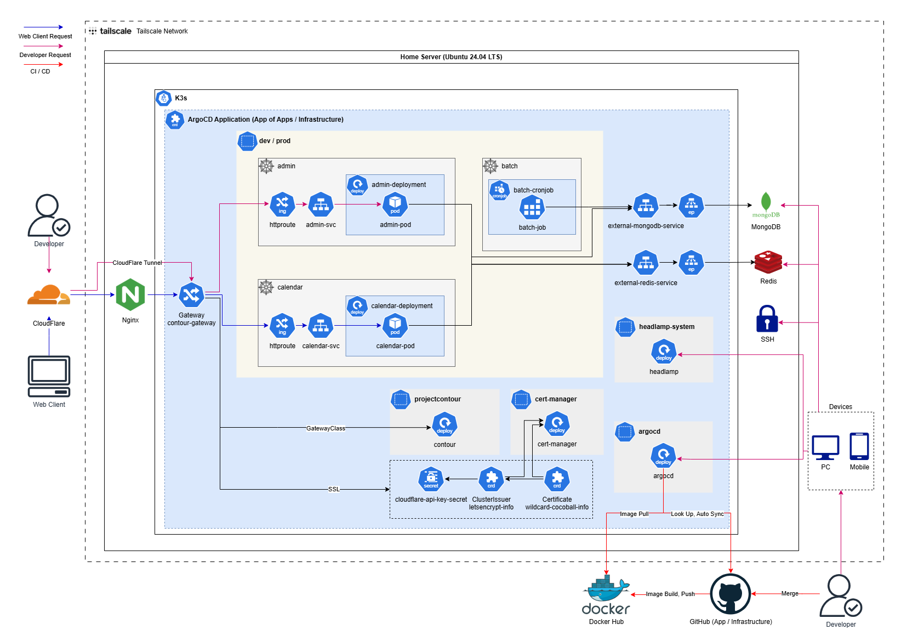

# PokecaGO GitOps Repository

### 인프라 아키텍처


### 기술 스택
- Backend
    - Kotlin
    - Spring Boot 4.0.2
    - Spring Data MongoDB
    - Spring Security
    - Spring Batch
    - MongoDB (Standalone, Docker on host)
    - Redis (Standalone, Docker on host)
    - Thymeleaf + JavaScript (어드민)
- Infrastructure
    - Ubuntu Server 24.04 LTS
    - Docker
    - Kubernetes (K3s)
    - Tailscale
    - Nginx
    - Cloudflare (DNS, Tunnel)
    - Let's Encrypt
    - Cert-Manager
    - Contour Gateway
- CI / CD
    - GitHub Actions
    - DockerHub
    - ArgoCD
    - Helm

### 디렉터리 구조
```aiignore
bootstrap      # app-of-apps를 위한 디렉토리, dev/prod와 infrastructure로 분류
components     # 기본 Helm Chart 디렉토리, apps와 infra로 분류
environments   # 환경별 values.yaml을 위한 디렉토리, dev/prod로 분류
```

### CI / CD 플로우
```aiignore
# 서비스 CI / CD 배포 시
1. 브랜치 코드 푸시 감지
2. GitHub Actions -> doriball-github-actions의 CI / CD Composite Action 호출
  - Gradle Test / Build
  - Docker Build & Push, 이미지 태그 추출
  - GitOps 리포지토리의 environments 내 values.yml 이미지 태그 변경
3. ArgoCD Auto Sync로 GitOps repo 변경 감지 후 자동 배포 또는 수동 배포

# GitOps 변경 시
1. ArgoCD Auto Sync로 GitOps repo 변경 감지 후 자동 배포 또는 수동 배포
```